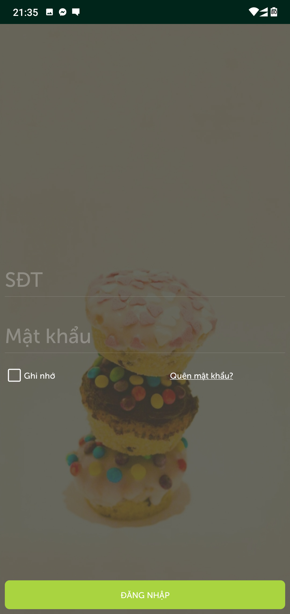
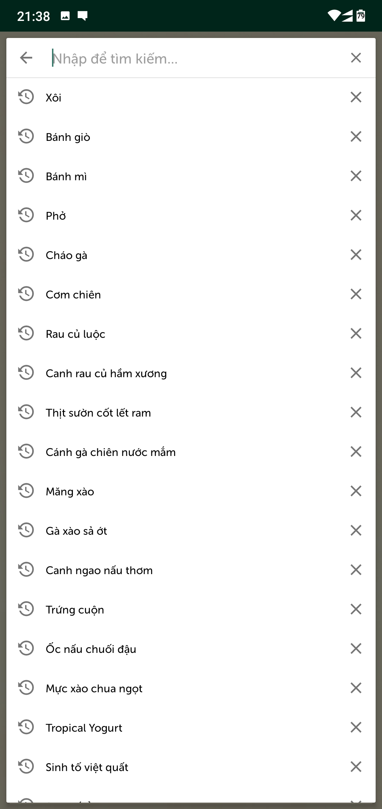

# Order Foods App
## 1. Mục tiêu và Chức năng (Goals and Objects)
### * Mục tiêu - Goals
- Ứng dụng đặt món sử dụng Google Firebase để lưu trữ và kiểm soát dữ liệu.
- Được xây dựng chủ yếu dựa trên thư viện Androidx.
- Thông qua ứng dụng có thể hiểu thêm về cách thức hoạt động của Google Firebase để lưu trữ và truyền thông tin đến ứng dụng đích.
- Mã nguồn là miễn phí, lập trình viên có thể sử dụng, thay đổi để xây dựng app cùng chức năng.
- Đã test các chức năng cơ sở và không có lỗi.

> - Ordering application that uses Google Firebase to store and control data.
> - The application is built primarily on the Androidx library.
> - Through the application can learn more about how Google Firebase works to store and transfer information to the target application.
> - Source code is free, programmers can use, change to build apps with the same functionality.
> - Tested basic functions and no errors.
  
### * Chức năng - Objects
**_Sign in, Sign up, Sign out._**
 

  
  
  
  

**_Forgot password, changed password._**
- 

  
  
  

**_Showing list menu, list food, food details._**
- 

  
  
  
  

**_Searching Foods._**
- 

  
  

**_Showing Cart._**
- 

  
  

**_Ordering._**
- 

  
  

**_Showing list Orders and Order Detail with status._**
- 

  
  

**_Adding and showing favorite foods and Rating._**
- 

  
  
  

**_Adding payment method,COD._**
- 

  
  

## 2. Công cụ và công nghệ sử dụng - Tools and Technological
- Android Studio.
- Firebase Google.
- Git.
- Source Tree or GitKraken to manage code.
- SQLite to CRUD data from database.
- SDK target version: 28
## 3. Hướng dẫn cài đặt và sử dụng - Instructions for installing and using
### * Cài đặt - Installing
_Yêu cầu - Requirements_
- JDK 1.8 hoặc mới hơn (JDK version 1.8 or newer): https://www.oracle.com/technetwork/java/javase/downloads/jdk8-downloads-2133151.html
- Android Studio: https://developer.android.com/studio
- Git - Chọn phiên bản phù hợp với hđh (Choose the version that suits your operating system): https://git-scm.com/downloads
- Source Tree - Chọn phiên bản phù hợp với hđh (Choose the version that suits your operating system): https://www.sourcetreeapp.com/
### * Sử dụng - Using
1. Copy URl https://github.com/Nguyenthinh19/SE03-Group19.git
2. Mở GitKraken hoặc SourceTree (Open GitKraken or SourceTree)
- **_SourceTree_**
> New -> Clone from URL -> paste URL link to Source URl, Select directory folder to save project -> press "Clone" button
- **_GitKraken_**
> Clone a repo -> Clone with URL -> paste URL link to URl, Browse to folder to save project in "Where to clone to" -> press "Clone the repo" button
## 4. Thành viên trong nhóm - Members
- Nguyễn Đức Thịnh - 17001510.
- Nguyễn Văn Thắng - 17000231.
- Hà Đức Trung - 17001516.
- Trần Tuấn Thành - 17001655.
